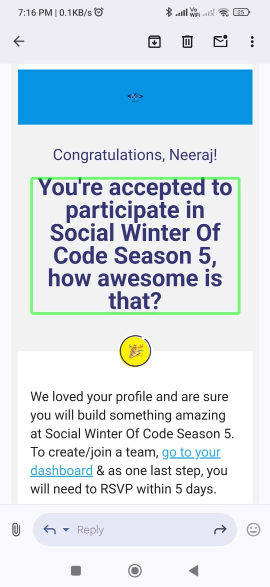
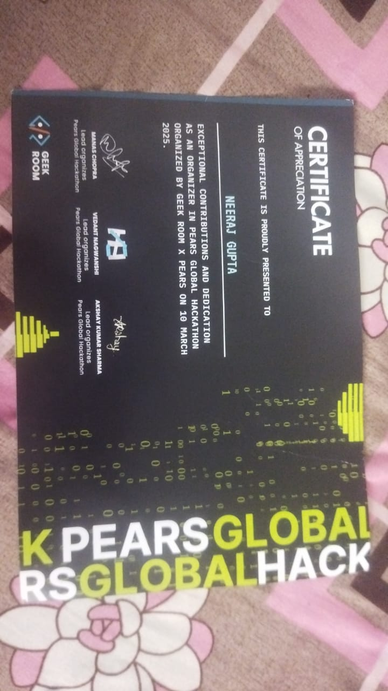

# 👋 Hello, I'm Neeraj Gupta

🎓 CSE Student | Python Developer | AI/ML & Accessibility Enthusiast  
🏆 Winter Code 5.0 | PEARS Hackathon | SSOC Contributor  
🎤 Poet | Audio/Video Editor | Open Source Contributor

---

## 🚀 Projects

### 🤟 Isllator – *India's First Indian Sign Language (ISL) Translator*

> *A New Hope for People with Multiple Disabilities*

This AI-based translator converts **ISL hand signs into speech or text** in real-time — enabling communication for those who can't speak. Specially designed for multi-disabled users.

🎥 [Watch Demo Video](https://drive.google.com/file/d/1WUeLNjcUAdjX3Hc95lOtFxb2GuCXv0a1/view?usp=drive_link)

**Key Features:**
- Real-Time Hand Sign to Speech/Text
- Voice Feedback for Visually Impaired Educators
- AI Chatbot for Learning ISL
- Usable in Schools, Hospitals, Offices

---

### 📥 X-Downloader – Universal Media Downloader

A powerful tool to download content from **YouTube, Instagram, and Spotify**, supporting multiple formats and batch downloads.  
Developed for ease-of-use and accessibility.

🔗 [Available on LinkedIn](https://www.linkedin.com/in/neeraj-gupta26)

---

### 🏏 PlayCricket – Audio-Based Cricket Game

An accessible cricket game designed for **visually impaired users**, fully compatible with screen readers.

🔗 [GitHub Repo](https://github.com/NeerajGupta26/PlayCricket)

---

### 🎵 MoodMusics – Mood-Based Music Recommender

Detects your **mood using facial expressions** (OpenCV) and plays suitable music accordingly.  
Built with Django, minimal UI.

🔗 [GitHub Repo](https://github.com/NeerajGupta26/MoodMusics)

---

### 📝 To-Do List – Task Manager

A simple and effective task manager app where users can **add, delete, and manage tasks** with clean UI.

🔗 [GitHub Repo](https://github.com/NeerajGupta26/To-Do-List)

---

## 🏅 Certificates & Achievements

  
  
  

🎓 Other Certifications:
- Git & GitHub – `Neeraj_Gupta_git_Certificate.pdf`
- React Project – `react-project-neeraj-Gupta-Certificate.pdf..pdf`
- Python Basics – `Python.png`

---

## 🌐 Connect With Me

- 💼 [LinkedIn](https://www.linkedin.com/in/neeraj-gupta26)
- 🐙 [GitHub](https://github.com/NeerajGupta26)

---

## 📊 GitHub Stats

---

## ⚙️ Skills

- **Languages:** Python, JavaScript, HTML, SQL  
- **Frameworks:** Django  
- **Libraries:** OpenCV, Whisper, Google STT  
- **Tools:** Git, Audacity, Canva  
- **Domains:** AI/ML, Accessibility, Game Dev, Audio/Video Editing

---

> “Technology is my toolkit, empathy is my drive. I build to empower.” — *Neeraj Gupta*
